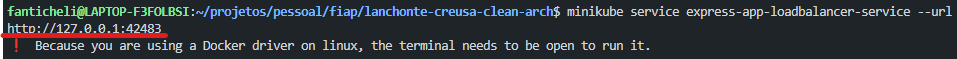

# lanchonte-creusa-clean-arch
Sistema de pedidos para lanchonetes. Cadastro de clientes, gestão de produtos e acompanhamento em tempo real. Desenvolvido em Nodejs+Express e MongoDB utilizando clean arch. Melhore o atendimento e satisfação dos clientes.

# Implantação da Aplicação no Kubernetes Local

1 - Faça o Clone da aplicação : git clone https://github.com/fanticheli/lanchonte-creusa-clean-arch.git

2 - Starte o clueste local do k8s: minikube start

3 - Verifique se o cluster está rodando: kubectl cluster-info

4 - Acesse a pasta do projeto e execute o comando: kubectl apply -f k8s && kubectl apply -f k8s/mongo && kubectl apply -f k8s/application

5 - Verifique se os pods estão rodando: kubectl get pods

6 - Verifique se os serviços estão rodando: kubectl get svc

7 - Acesse o serviço da aplicação: minikube service express-app-loadbalancer-service --url

    O resultado deve ser parecido com o da imagem acima. Utilize a url para acessar a aplicação. Atende-se na porta da imagem, ela pode variar de acordo com a sua configuração do k8s local.
